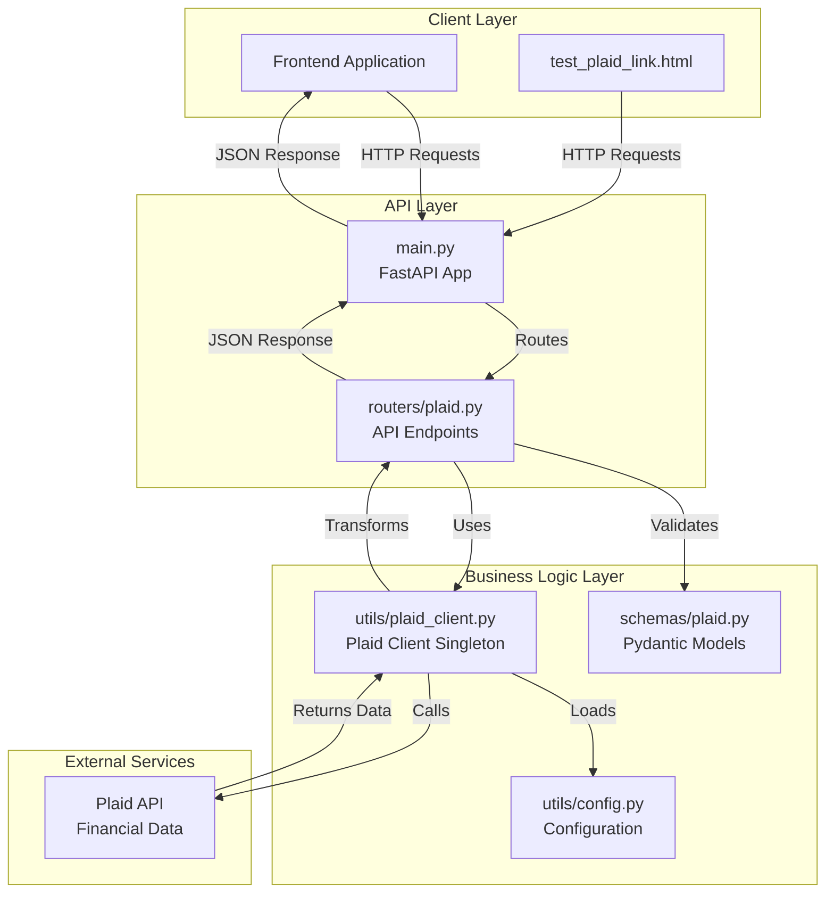
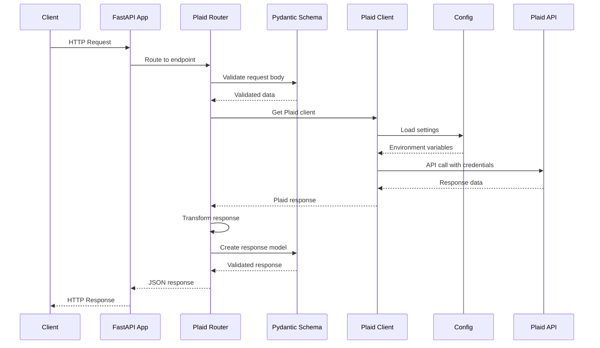
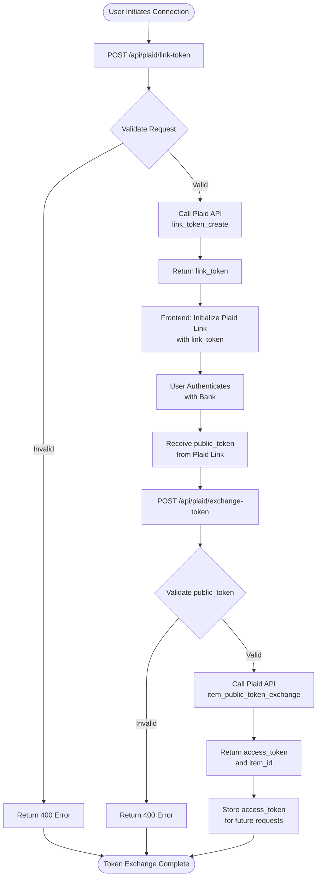
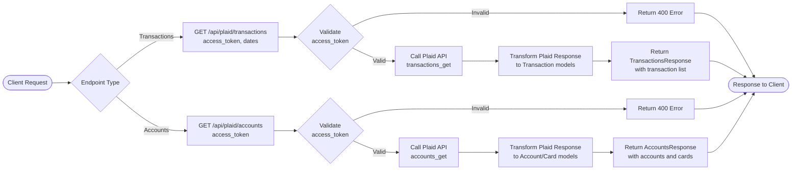

# FastAPI Plaid Integration - Codebase Documentation

## Table of Contents

1. [Overview](#overview)
2. [Architecture](#architecture)
3. [Request Flow](#request-flow)
4. [File Structure](#file-structure)
5. [API Endpoints](#api-endpoints)
6. [Configuration](#configuration)
7. [Usage Examples](#usage-examples)
8. [Technical Details](#technical-details)

## Overview

This FastAPI application provides a backend integration with Plaid, enabling secure access to financial data including bank accounts, transactions, and credit cards. The application follows a clean architecture pattern with separation of concerns between routing, business logic, data validation, and external API communication.

### Key Features

- **Link Token Creation**: Generate secure tokens for Plaid Link frontend initialization
- **Token Exchange**: Convert public tokens to access tokens for API access
- **Transaction Retrieval**: Fetch transaction history with filtering and pagination
- **Account Management**: Retrieve account and card information with balance details

### Technology Stack

- **FastAPI**: Modern, fast web framework for building APIs
- **Plaid Python SDK**: Official Plaid SDK for Python
- **Pydantic**: Data validation using Python type annotations
- **Python-dotenv**: Environment variable management

## Architecture

The application follows a layered architecture with clear separation between API routes, business logic, data models, and external service integration.



### Component Relationships

- **FastAPI App** (`main.py`): Application entry point that registers routers and configures the API
- **Router** (`routers/plaid.py`): Handles HTTP requests, validates input, and orchestrates business logic
- **Schemas** (`schemas/plaid.py`): Pydantic models for request/response validation and serialization
- **Plaid Client** (`utils/plaid_client.py`): Singleton wrapper around Plaid SDK for API communication
- **Config** (`utils/config.py`): Centralized configuration management from environment variables

## Request Flow

The following diagram illustrates the complete request flow from client to Plaid API and back:



## Token Exchange Flow

The Plaid integration uses a two-step token exchange process for security:



## Data Retrieval Flow

Once an access token is obtained, the application can retrieve financial data:



## File Structure

```
fastapi-plaid/
│
├── app/
│   ├── main.py                    # FastAPI application entry point
│   │
│   ├── routers/
│   │   ├── __init__.py           # Router package initialization
│   │   └── plaid.py              # Plaid API endpoints (4 endpoints)
│   │
│   ├── schemas/
│   │   ├── __init__.py           # Schema package initialization
│   │   └── plaid.py              # Pydantic models for request/response
│   │
│   ├── models/
│   │   └── __init__.py           # Models package (reserved for future DB models)
│   │
│   └── utils/
│       ├── __init__.py           # Utils package initialization
│       ├── config.py             # Environment configuration management
│       └── plaid_client.py       # Singleton Plaid client wrapper
│
├── venv/                          # Python virtual environment (gitignored)
├── requirements.txt               # Python dependencies
├── .gitignore                     # Git ignore rules
├── test_plaid_link.html          # Frontend integration example
└── CODEBASE.md                    # This documentation file
```

### File Descriptions

#### `app/main.py`
FastAPI application entry point that:
- Initializes the FastAPI app with metadata (title, description, version)
- Registers the Plaid router with prefix `/api/plaid`
- Provides a root endpoint for health checks

#### `app/routers/plaid.py`
Contains all Plaid-related API endpoints:
- `POST /api/plaid/link-token`: Creates a link token for Plaid Link initialization
- `POST /api/plaid/exchange-token`: Exchanges public token for access token
- `GET /api/plaid/transactions`: Retrieves transaction history
- `GET /api/plaid/accounts`: Retrieves account and card information

Each endpoint includes:
- Request validation using Pydantic schemas
- Error handling with appropriate HTTP status codes
- Response transformation from Plaid SDK objects to Pydantic models
- Enum conversion utility for Plaid enum types

#### `app/schemas/plaid.py`
Pydantic models for type-safe request/response handling:
- **Request Models**: `LinkTokenRequest`, `ExchangeTokenRequest`
- **Response Models**: `LinkTokenResponse`, `ExchangeTokenResponse`, `TransactionsResponse`, `AccountsResponse`
- **Data Models**: `Transaction`, `Account`, `Card`, `AccountBalance`, `TransactionLocation`

#### `app/utils/config.py`
Configuration management:
- Loads environment variables from `.env` file
- Validates required settings (PLAID_CLIENT_ID, PLAID_SECRET)
- Provides default values (PLAID_ENVIRONMENT defaults to "sandbox")
- Raises clear error messages if configuration is missing

#### `app/utils/plaid_client.py`
Singleton Plaid client wrapper:
- Implements singleton pattern to ensure single client instance
- Initializes Plaid client with credentials from config
- Maps environment strings to Plaid Environment enum
- Provides `get_plaid_client()` function for dependency injection

#### `test_plaid_link.html`
Frontend integration example demonstrating:
- How to request a link token from the API
- How to initialize Plaid Link with the token
- How to handle the public token callback
- How to exchange the token and use the access token

## API Endpoints

### 1. Create Link Token

**Endpoint**: `POST /api/plaid/link-token`

**Description**: Creates a link token that is used to initialize Plaid Link on the frontend.

**Request Body**:
```json
{
  "user_id": "user_123",
  "client_name": "FastAPI Plaid Integration"
}
```

**Response** (200 OK):
```json
{
  "link_token": "link-sandbox-abc123...",
  "expiration": "2024-01-01T12:00:00Z"
}
```

**Error Response** (500):
```json
{
  "detail": "Failed to create link token: <error message>"
}
```

### 2. Exchange Token

**Endpoint**: `POST /api/plaid/exchange-token`

**Description**: Exchanges a public token (received from Plaid Link) for an access token that can be used for API calls.

**Request Body**:
```json
{
  "public_token": "public-sandbox-abc123..."
}
```

**Response** (200 OK):
```json
{
  "access_token": "access-sandbox-xyz789...",
  "item_id": "item_123456"
}
```

**Error Response** (400):
```json
{
  "detail": "Failed to exchange token: <error message>"
}
```

### 3. Get Transactions

**Endpoint**: `GET /api/plaid/transactions`

**Description**: Retrieves transaction history for an account. If dates are not provided, defaults to the last 30 days.

**Query Parameters**:
- `access_token` (required): Plaid access token
- `start_date` (optional): Start date in YYYY-MM-DD format
- `end_date` (optional): End date in YYYY-MM-DD format

**Example Request**:
```
GET /api/plaid/transactions?access_token=access-sandbox-xyz789&start_date=2024-01-01&end_date=2024-01-31
```

**Response** (200 OK):
```json
{
  "transactions": [
    {
      "transaction_id": "txn_123",
      "account_id": "acc_456",
      "amount": 50.00,
      "date": "2024-01-15",
      "name": "Coffee Shop",
      "merchant_name": "Coffee Shop Inc",
      "category": ["Food and Drink", "Restaurants"],
      "location": {
        "address": "123 Main St",
        "city": "San Francisco",
        "region": "CA",
        "postal_code": "94105",
        "country": "US",
        "lat": 37.7749,
        "lon": -122.4194
      },
      "payment_channel": "in_store",
      "pending": false
    }
  ],
  "total_transactions": 1
}
```

**Error Response** (400):
```json
{
  "detail": "Failed to fetch transactions: <error message>"
}
```

### 4. Get Accounts

**Endpoint**: `GET /api/plaid/accounts`

**Description**: Retrieves all accounts and credit cards associated with an item.

**Query Parameters**:
- `access_token` (required): Plaid access token

**Example Request**:
```
GET /api/plaid/accounts?access_token=access-sandbox-xyz789
```

**Response** (200 OK):
```json
{
  "accounts": [
    {
      "account_id": "acc_123",
      "name": "Checking Account",
      "official_name": "Chase Total Checking",
      "type": "depository",
      "subtype": "checking",
      "balances": {
        "available": 1000.00,
        "current": 1000.00,
        "limit": null,
        "iso_currency_code": "USD",
        "unofficial_currency_code": null
      }
    }
  ],
  "cards": [
    {
      "account_id": "acc_456",
      "name": "Credit Card",
      "official_name": "Chase Sapphire",
      "type": "credit",
      "subtype": "credit card",
      "balances": {
        "available": null,
        "current": -500.00,
        "limit": 5000.00,
        "iso_currency_code": "USD",
        "unofficial_currency_code": null
      }
    }
  ]
}
```

**Error Response** (400):
```json
{
  "detail": "Failed to fetch accounts: <error message>"
}
```

## Configuration

### Environment Variables

Create a `.env` file in the root directory with the following variables:

```env
PLAID_CLIENT_ID=your_client_id_here
PLAID_SECRET=your_secret_here
PLAID_ENVIRONMENT=sandbox
```

### Environment Variable Descriptions

- **PLAID_CLIENT_ID** (required): Your Plaid client ID from the Plaid dashboard
- **PLAID_SECRET** (required): Your Plaid secret key (different for sandbox/production)
- **PLAID_ENVIRONMENT** (optional): Environment to use - `sandbox` or `production` (defaults to `sandbox`)

### Setup Instructions

1. **Install Dependencies**:
   ```bash
   pip install -r requirements.txt
   ```

2. **Create `.env` File**:
   ```bash
   cp .env.example .env  # If you have an example file
   # Or create manually with your Plaid credentials
   ```

3. **Configure Plaid Credentials**:
   - Sign up at [Plaid Dashboard](https://dashboard.plaid.com/)
   - Get your `client_id` and `secret` from the dashboard
   - Add them to your `.env` file

4. **Run the Application**:
   ```bash
   uvicorn app.main:app --reload
   ```

5. **Access API Documentation**:
   - Swagger UI: http://localhost:8000/docs
   - ReDoc: http://localhost:8000/redoc

## Usage Examples

### Example 1: Complete Integration Flow

```python
import requests

BASE_URL = "http://localhost:8000/api/plaid"

# Step 1: Create link token
link_token_response = requests.post(
    f"{BASE_URL}/link-token",
    json={"user_id": "user_123", "client_name": "My App"}
)
link_token = link_token_response.json()["link_token"]

# Step 2: Use link_token in frontend to initialize Plaid Link
# (See test_plaid_link.html for frontend example)

# Step 3: After user authenticates, exchange public token
exchange_response = requests.post(
    f"{BASE_URL}/exchange-token",
    json={"public_token": "public-sandbox-abc123..."}
)
access_token = exchange_response.json()["access_token"]

# Step 4: Fetch transactions
transactions_response = requests.get(
    f"{BASE_URL}/transactions",
    params={
        "access_token": access_token,
        "start_date": "2024-01-01",
        "end_date": "2024-01-31"
    }
)
transactions = transactions_response.json()

# Step 5: Fetch accounts
accounts_response = requests.get(
    f"{BASE_URL}/accounts",
    params={"access_token": access_token}
)
accounts = accounts_response.json()
```

### Example 2: Using with cURL

```bash
# Create link token
curl -X POST "http://localhost:8000/api/plaid/link-token" \
  -H "Content-Type: application/json" \
  -d '{"user_id": "user_123", "client_name": "My App"}'

# Exchange token
curl -X POST "http://localhost:8000/api/plaid/exchange-token" \
  -H "Content-Type: application/json" \
  -d '{"public_token": "public-sandbox-abc123..."}'

# Get transactions
curl "http://localhost:8000/api/plaid/transactions?access_token=access-sandbox-xyz789&start_date=2024-01-01&end_date=2024-01-31"

# Get accounts
curl "http://localhost:8000/api/plaid/accounts?access_token=access-sandbox-xyz789"
```

### Example 3: Frontend Integration

See `test_plaid_link.html` for a complete frontend example that:
1. Requests a link token from the API
2. Initializes Plaid Link
3. Handles the public token callback
4. Exchanges the token
5. Uses the access token to fetch data

## Technical Details

### Singleton Pattern in PlaidClient

The `PlaidClient` class uses a singleton pattern to ensure only one instance of the Plaid client exists throughout the application lifecycle. This is implemented using:

```python
class PlaidClient:
    _instance = None
    _client = None

    def __new__(cls):
        if cls._instance is None:
            cls._instance = super(PlaidClient, cls).__new__(cls)
            cls._instance._initialize_client()
        return cls._instance
```

**Benefits**:
- Prevents multiple client initializations
- Reduces memory usage
- Ensures consistent configuration across the application

### Error Handling

The application uses FastAPI's `HTTPException` for error handling:

- **400 Bad Request**: Invalid input or Plaid API errors (token exchange, data retrieval)
- **500 Internal Server Error**: Server-side errors (link token creation failures)

All errors return a JSON response with a `detail` field containing the error message.

### Enum Conversion

Plaid SDK returns enum objects, but JSON serialization requires strings. The `convert_enum_to_string()` utility function handles this conversion:

```python
def convert_enum_to_string(value):
    if value is None:
        return None
    if isinstance(value, str):
        return value
    if hasattr(value, 'value'):
        return str(value.value)
    return str(value)
```

This function is used for:
- `payment_channel` in transactions
- `type` and `subtype` in accounts

### Response Transformation

The Plaid SDK can return responses as either dictionary objects or model objects depending on the SDK version. The router handles both cases:

```python
# Handle both dict and object responses
access_token = response.get("access_token") if isinstance(response, dict) else response.access_token
```

This ensures compatibility across different Plaid SDK versions.

### Date Handling

Transaction endpoints accept date parameters in `YYYY-MM-DD` format. If not provided:
- `start_date` defaults to 30 days ago
- `end_date` defaults to today

Dates are converted to Python `date` objects for Plaid API compatibility.

### Account vs Card Separation

The accounts endpoint separates regular accounts from credit cards:
- **Accounts**: All non-credit account types (checking, savings, investment, etc.)
- **Cards**: Credit card accounts (type is "credit" or subtype contains "credit")

This separation makes it easier for frontend applications to display different account types differently.

---

## Additional Resources

- [Plaid API Documentation](https://plaid.com/docs/)
- [FastAPI Documentation](https://fastapi.tiangolo.com/)
- [Pydantic Documentation](https://docs.pydantic.dev/)


